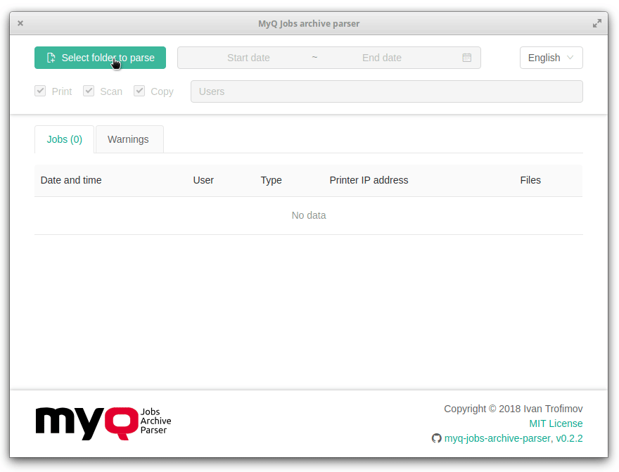

# MyQ Jobs Archive Parser


## Downloads

- [Latest releases](https://github.com/trofivan/myq-jobs-archive-parser/releases/latest) for Windows, MacOS and Linux
- Fake data jobs to parsing:
  - [fake-data-small.zip](https://github.com/trofivan/myq-jobs-archive-parser/releases/download/v0.1.0/fake-data-small.zip) (942 KB)
  - [fake-data-medium.zip](https://github.com/trofivan/myq-jobs-archive-parser/releases/download/v0.1.0/fake-data-medium.zip) (12.5 MB)
  - [fake-data-big.zip](https://github.com/trofivan/myq-jobs-archive-parser/releases/download/v0.1.0/fake-data-big.zip) (70.5 MB)

## What is MyQ?

MyQ — it's enterprise software for printing and scanning control. More info on the [official website](https://www.myq-solution.com/).

## What is MyQ Jobs Archive Parser?

This is small `*.xml` parsing software and user-friendly visual representation of archived MyQ jobs. More info about MyQ jobs archiving you can found in official documentation.



**MyQ Jobs Archive Parser** is shipped as is and is not an official part of the [MyQ software](https://www.myq-solution.com/).

<!--
## Latest releases

https://github.com/trofivan/myq-jobs-archive-parser/releases/latest

for Windows, Linux and MacOS:
 -->

## License

[MIT](LICENCE)

# For developers

## Technologies

- JavaScript (ES6+)
- [Node.js](https://nodejs.org/en/)
- [React](https://reactjs.org/)
- [Redux](https://redux.js.org/)
- [NW.js](https://nwjs.io/) (previously known as node-webkit)
- [Ant Design](https://ant.design/)

## How to build?

```sh
git clone https://github.com/trofivan/myq-jobs-archive-parser.git
cd myq-jobs-archive-parser
npm i
npm start
```

## The Redux state example of application

```js
{
  locale: 'en',
  filter: {
    users: ['dlatek6p', 'mesp60'],
    jobsType: ['print', 'scan', 'copy'],
    dateRange: [null, null]
  },
  jobsFolder: '/home/username/Desktop/__data__',
  jobs: {
    isFetching: false,
    list: [
      {
        key: 0,
        xmlFile: '/home/username/Desktop/__tests__/dirs/job-print.xml',
        timestamp: 1501903926000,
        jobType: 'print',
        printerAddr: '53.201.154.38',
        serverName: 'SRV-MYQ01.domain.local',
        serverVersion: '6.2.4.27',
        username: 'mesp60',
        files: ['job-0.pdf', 'job-1.pdf']
      },
      {
        key: 1,
        xmlFile: '/home/username/Desktop/__tests__/xml/job-copy.xml',
        timestamp: 1501903926000,
        jobType: 'copy',
        printerAddr: '53.201.154.38',
        serverName: 'SRV-MYQ01.domain.local',
        serverVersion: '6.2.4.27',
        username: 'dlatek6p',
        files: ['job-0.pdf', 'job-1.pdf', 'job-2.pdf']
      },
      {
        key: 2,
        xmlFile: '/home/username/Desktop/__tests__/dirs/dir_1/job-scan.xml',
        timestamp: 1501903926000,
        jobType: 'scan',
        printerAddr: '53.201.154.38',
        serverName: 'SRV-MYQ01.domain.local',
        serverVersion: '6.2.4.27',
        username: 'mesp60',
        files: ['job-0.pdf']
      },
      {
        key: 3,
        xmlFile: '/home/username/Desktop/__tests__/dirs/dir_4/job-invalid.xml',
        error:
          'Non-whitespace before first tag. | Line: 0 | Column: 1 | Char: I'
      },
      {
        key: 4,
        xmlFile: '/home/username/Desktop/__tests__/dirs/job-invalid.xml',
        error:
          'Non-whitespace before first tag. | Line: 0 | Column: 1 | Char: I'
      }
    ]
  }
}
```
